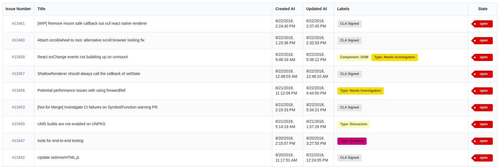

# GitHub Issues Table

This is a simple component that shows the issues of a particular GitHub project



## Usage

This section shows how to use this component.

### Setup

Install the dependency
```
npm i -S @pcmnac/github-issues-table
```

You also have to install peer dependencies

```
npm i -S semantic-ui-css
npm i -S semantic-ui-react
```

Import CSS in your project
```jsx
import 'semantic-ui-css/semantic.min.css';
```

### Example

```jsx
import React from 'react';
import GithubIssuesTable from '@pcmnac/github-issues-table';

const App = () => (
    <div>
        <h1>My App</h1>
        <GithubIssuesTable user="facebook" repo="react" />
    </div>
);

export default App;
```

## Contribute

This section shows the basics to maintain this component

### Local test
```
git clone https://github.com/pcmnac/github-issues-table.git
cd github-issues-table
npm i
npm start
```
### Build and Publish

```
npm version x.y.z
npm publish
```


